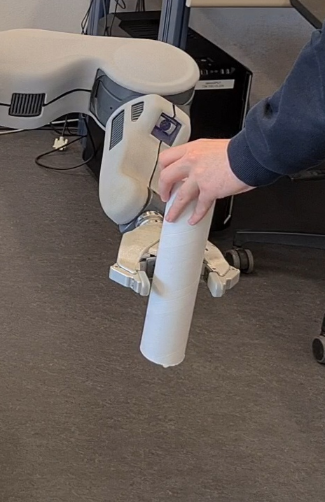

# Overview
This code belongs to my master's thesis "Bimanual Robot-to-Robot Handover Utilizing Multi-Modal Feedback". It covers the mentioned pipeline to perform bimanual handovers on a PR2 robot as well as the corresponding code for training a new grasping model, and performing a workspace analysis. Check the thesis for any conceptual questions. The next section gives an overview over the code structure of this project. For starting anything, check the section about the desired part first. This repository contains all the required code, but not all data for the thesis.

# Structure
The *config* folder contains two types of files: yaml files and rviz configs. The yaml config files set the parameters for any handover or training attempt, so it is important to set them to the desired parameters before starting anything. Each section explains their config file in detail. The exception is *pc\_filter.yaml*, which is a config file for the [robot\_body\_filter](https://github.com/peci1/robot_body_filter). It should not need any adaptation. The rviz configs are just helpful for visualizations and include the settings used to make screenshots from various angles of the workspace analysis for the thesis.

The *launch* folder holds the launch files for this project. Only three out of the four available are designed to be launched manually. The *pc\_filter.launch* is called by other launch files exclusively. The files *full.launch*, *train.launch*, and *workspace\_analysis.launch* start the handover pipeline, the training process, and the workspace analysis respectively. Before calling one, it is advised to visit the section about the corresponding task first.

The *data* folder contains a saved point cloud and a script to load it for the demo version of the pipeline. Further, the *data/workspace\_analysis* folder contains bags of available optimal handover poses to sample from. When not just using the git repository but the version containing all data, it also contains the subfolders *data/actions*, *data/plots*, and *data/records*. The first two contain data relevant for plotting, explained later during the available scripts part. The last one contains data of the evaluation of the side and top grasp models. Additionally, the *data/workspace\_analysis* subfolder then also holds the raw analysis data for further visualiization.

The *models* folder contains all available finished RL grasping models as options to use in the pipeline. The two best models for side and top grasps are listed in the config file for the pipeline. This folder also contains the replay buffer for each model. Additionally, some .txt files provide further information about the models. When using the full data version of this repository, it also contains a subfolder *models/checkpoints*, which includes all checkpoints of these models.

The *src* folder contains the code for the pipeline. Even though some files are theoretically callable, do not call them but use the correct launch files instead. Following is a list of contained files with a short description of their functionality:
- *handover\_controller.py*: contains the main controller for the pipeline. It calls every service of the pipeline in the correct order to perform handovers. 
- *initial\_setup.py*: contains the service to move the robot in the default starting configuration and grasp the object initially with the two-finger gripper with the help of a human operator.
- *capture\_pc.py*: contains the service to move the gripper with the object before the RGB-D camera to gather a point cloud of the object. The point is published under the topic "pc/pc\_raw" for further processing.
- *pc\_crop.cpp*: contains the service to receive a point cloud from the topic "pc/pc\_raw" and apply a cropbox filter to it. This point cloud is then send further on the topic "pc/pc\_cropped", which is the input topic for the *robot\_body\_filter*. It also receives point clouds on the topic "pc/pc\_filtered", which is the output topic of the *robot\_self\_filter*, and transforms them into the correct pose for later handover pose filtering. This transformed point cloud is published on the topic "pc/pc\_final".
- *capture\_pc.py*: waits to receive a point cloud on the topic "pc/pc\_final". Once received, it moves the arm with the gripper back into the default pose and sends a confirmation.
- *handover\_mover.py*: contains the service to choose a graps and handover pose and move to these poses. 
- *hand\_closer.py*: contains the service for performing the grasping action with the hand.
- *grasp\_tester.py*: contains the service to test a grasp by checking the force applied to the left arm through a small upwards motion of the hand.
- *finish\_handover.py*: contains the service to retract the gripper once a grasp test was successul and move the hand into the finish pose.
- *syn\_gras\_gen.py*: contains the code to generate joint configurations with the help of hand synergies and vice versa. Used for model training and when using a trained model for grasping during pipeline execution.
- *env.py*: contains the definition of the training environment for the RL training. It fulfills the "gym" interface of "stable-baselines3".
- *workspace\_analyzer.py*: contains code for performing a workspace analysis.
- *bio\_ik\_helper\_functions.py*: contains static functions helpful for generationg "bio\_ik" requests.

Finally comes the *scripts* folder. Besides the *train.py* script, any script can be called manually. They include:
- *train.py*: script gets called through the *train.launch* file. 
- *launch\_handover.py*: script needs to be called once the handover pipeline is ready after a call of *full.launch*. It allows to start the handover of one object. 
- *select\_random\_object.py*: script just prints a random generated list of objects used for training. 
- *dummy\_action\_server.py*: start a dummy action server for the "/hand/rh\_trajectory\_controller/follow\_joint\_trajectory" action server, that does nothing, to test the threshold and model closers without the real robot.
- *dummy\_publisher.py*: publish dummy msgs for "/hand/joint\_states", "/ft/l\_gripper\_motor", and "/hand/rh/tactile", that contain no information, to test the threshold and model closers, as well as the grasp tester, without a real robot.
In the *scripts/visualizers* subfolder exist additional scripts for visualizing data for the thesis:
- *plot\_actions.py*: plot recorded network outputs, loaded from .json files. The filenames need to be specified manually in the script as the variable "filenames". The current setting produces all action plots of the thesis, if the action files are in *data/actions*.
- *plot\_cost\_function.py*: produces a plot of the cost function used in the thesis.
- *plot\_training\_data.py*: produces plots of the training data for every model. Currently, it produces all plots for the trained models with the side grasp during the hyperparameter optimization. To plot the values for the top grasp, use the commented part under the "plot\_reward" function. For this to work, the data has to be available in *data/plots*.
- *visualize\_workspace.py*: allows to plot a workspace analysis in different ways. Refer to the workspace analysis section for further details.

When using the full data version of this repository, it also contains an additional logs folder, which contains the tensorboard log data of all training attemps. Load them using `tensorboard --logdir logs` while in the main directory.

Other files are only necessary to build the workspace.

# Handover Pipeline
The config file for the handover pipeline is *config.yaml*. Before starting handovers attempts or training, make sure its parameters are set correctly. These parameters are:
- *handover\_type*: determines how much of the handover pipeline gets executed. Available modes are "train" and "full". The first option only executes the pipeline until the hand and gripper are at the correct handover pose, without the hand grasping the object. The second option executes the full pipeline, finishing with the hand moving into the final pose. This option does not matter for the training pipeline.
- *initial\_setup*: currently only "fixed" is available.
- *record\_attempt*: whether or not to write information about the handover attempts into a .txt file under data/records. Useful for evaluating trained models, keep False for training.
- *handover\_mover*:
    - *grasp\_pose\_mode*: sets how the pipeline determines the grasp pose of the hand relative to the gripper. Options are "pc" and "fixed". If set to "pc", the grasp pose is determined by the point cloud reading of the object. Otherwise, the point cloud collection step is skipped entirely and hardcoded values are used. This option influences the training.
    - *handover\_pose\_mode*: sets how the pipeline chooses the handover pose. Options are "fixed", "load\_sample", or "random\_sample". The first option uses fixed values for the handover pose. The option "load\_sample" samples the handover pose from available poses provided by the file specified in the next paramter. Otherwise, "random\_sample" samples random handover poses from a grid before the robot. Both sampling strategies continue until they find a handover pose below the hardcoded threshold determined through workspace analyses in the thesis or they checked all poses. Highly relevant for training
    - *side\_sample\_file*: only relevant if *handover\_pose\_mode* is set to "load\_sample". Determines the rosbag with the handover poses to sample from for side grasps. The file has to be under *data/workspace\_analysis*. Only relevant for training if set to "load\_sample".
    - *top\_sample\_file*: only relevant if *handover\_pose\_mode* is set to "load\_sample". Determines the rosbag with the handover poses to sample from for top grasps. The file has to be under *data/workspace\_analysis*. Only relevant for training if set to "load\_sample".
    - *debug*: provide additional output for debugging.
    - *verbose*: print additional output to the console if *debug* is also set to True.
    - *write\_time*: write the time it takes to find a handover pose into a .txt file. This file will be written under *data/records*. Turn off for training.
- *grasp\_tester*:
    - *debug*: additional output for debugging.
    - *direction*: axis of the force sensor to use for grasp testing. Only tested for "y", so do not change.
- *hand\_closer*: Not relevant for training.
    - *closer\_type*: Decides how the hand is closed for grasping. Options are "threshold", "model", or "demo". The last option is used when running a test without the real robot. The "threshold" option closes the hand by adding a small constant value to the current joint value of each finger until the fingers make contact with the object. The "model" option uses an RL learned neural network to close the hand by utilizing hand synergies.
    - *debug*: Additional output for debugging.
    - *mode*: Which modality is used to determine contact with the object. Available options are "effort" and "tactile", but only "effort" is tested recently and used for the thesis.
    - *model\_closer*: Specific parameters only relevant to the model closer.
        - *write\_actions*: Whether or not to write the network output in a .txt file under *data/actions*.
        - *side\_model\_path*: The path to the model used for the model closer for side grasps.
        - *top\_model\_path*: The path to the model used for the model closer for top grasps.
        - *side\_model\_buffer*: The path to the replay buffer for the used model for side grasps.
        - *top\_model\_buffer*: The path to the replay buffer for the used model for top grasps.
        - *observation\_space*: Choose the inputs for the state space. The only recently tested ones are *pca*, *effort*, and *one\_hot*. Options are:
            - *joint\_values*: 9D vector of the joint values for the 9 closing joints.
            - *pca*: 3D hand synergy encoding of the current joint configuration of the hand.
            - *effort*: 9D effort difference values for the 9 clsoing joints.
            - *tactile*: 5D tactile difference values for the 5 BioTac sensors, one on each fingertip.
            - *one\_hot*: 3D one-hot encoding of the object currently used.
- *finish\_handover*:
    - *debug*: Additional output for debugging

Once these parameters are set, one can start the pipeline with the following steps:
1. Start the pipeline with `roslaunch bimanual_handover full.launch`. Optionally, if the pipeline should start without the real robot, one can add `demo:=true` to the call to launch the pipeline in demo mode.
2. Once the pipeline has started and publishes the info `handover_controller_srv initialized`, one can start a handover by calling `roslaunch bimanual_handover launch_handover.py object_type grasp_type`. Available object\_types are "can", "bleach", and "roll", while possible grasp types are "top" and "side".
3. Next, the initial\_setup will ask if the current object needs changing. If no object is currently a gripper, consider this as an object change. Enter "n" if the object should not be changed, otherwise enter "Y". If the object has to be changed, a new prompt will appear with a warning that the next step will open the gripper to release the currently held opject. Press enter when ready to catch the object. Afterward, a final prompt will warn that the gripper closes in the next step. Place the object in the gripper and press enter. Once finished, the handover process continues until the end.
4. To start an additional attempt, repeat with step 2.

# Training
As the training uses part of the handover pipeline, make sure the correct parameters for the pipeline are set as well. Only options before the *hand\_closer* parameters can be relevant. Refer to the handover pipeline section for more details. Before starting a training, make sure the correct parameters are set in the config file *train.yaml*. These parameters are:
- *timesteps*: for how many timesteps the model should train. For the thesis, this value mostly remained at 12000 steps.
- *model\_type*: the RL algorithm used for training. Theoretically, "ppo" is available as well but recent tests and the thesis only considered "sac", so the other model might encounter issues.
- *model\_path*: if it is desired to train a new model, set it to an empty string. Otherwise, state the filepath to the model for continuing the training, starting from the "bimanual\_handover" directory. Make sure the corresponding replay buffer file lies in the same directory.
- *checkpoint*: only relevant if continuing a training. Set to True if the training continues froma checkpoint. Otherwise, for example when continuing the training of a finished model, set it to False.
- *contact\_modality*: which modality to use for contact checking with the object. While "tactile" is theoretically possible, it can cause issues and the thesis only used "effort".
-  *env\_check*: whether or not to call the environment check from "stable-baselines3" to make sure the environment is correct.
- *record*: whether or not to record the actions and observations of the model during training as a .txt file. Not used for the thesis.
- *observation\_space*: choose the inputs for the state space. The only recently tested ones are *pca*, *effort*, and *one\_hot*. Options are:
    - *joint\_values*: 9D vector of the joint values for the 9 closing joints.
    - *pca*: 3D hand synergy encoding of the current joint configuration of the hand.
    - *effort*: 9D effort difference values for the 9 clsoing joints.
    - *tactile*: 5D tactile difference values for the 5 BioTac sensors, one on each fingertip.
    - *one\_hot*: 3D one-hot encoding of the object currently used.
- *architecture*:
    - *entropy\_coefficient*: the value of the entropy coefficient, as used during hyperparameter optimzation in the thesis.
    - *actor*: list of hidden layer sizes for the actor network.
    - *critic*: list of hidden layer sizes for the critic network.

Now, to start and execute a training follow these steps:
1. Launch the training process through `roslaunch bimanual_handover train.launch`
2. Once it has loaded everything correctly, the training will give input prompts to ask for the object type used for the next 1000 training steps and which grasp type to use. Available objects are chips can[1], blecah bottle[2], and paper roll[3]. Possible grasp types (the prompt will ask for side) are "side" and "top".
3. Next, the training will ask if the current object needs changing. If no object is currently a gripper, consider this as an object change. Enter "n" if the object should not be changed, otherwise enter "y". If the object has to be changed, a new prompt will appear with a warning that the next step will open the gripper to release the currently held opject. Press enter when ready to catch the object. Afterward, a final prompt will warn that the gripper closes in the next step. Place the object in the gripper and press enter. Once finished, the training process starts.
4. The process continues to train for 1000 steps with the current object. Afterward, it will ask again for the next object and the process restarts at step 2. Continue with this process until the training is finished.

**IMPORTANT: Because the training runs with tqdm, its output might overwrite the prompts. Howver, the prompts are still there and inputs will still work as normal. Simply follow the input prompst as stated here.**

The training saves checkpoints every 100 training steps. If the training gets interrupted, change the yaml file to load the last available checkpoint and restart the training. The checkpoints are saved in the subfolder *models/checkpoints*, while the finished models are saved directly in the *models* folder.

# Workspace Analysis
The config file for the workspace analysis is *workspace.yaml*. It contains the following options:
- *load*: Specify the file name of the workspace analysis to continue expanding. The .json file has to be under *data/workspace\_analysis*. Set to an empty string to start a new workspace analyis.
- *grasp\_type*: The grasp type to perform the workspace analysis with. Options are "top", "side", "side\_x", and "side\_y". The last two option correspond to the x- and y-shifted side grasp, respectively. Set to the correct type used in the loaded file, if a file is loaded.
- *object\_type*: currently makes no difference for the analysis. Options are "can", "bleach", and "roll".
- *debug*: Additional information for debugging.
- *verbose*: Log additional information to the console if debug is also turned on.

Once the parameters in the config file are set correctly, start the analysis through the following steps:
1. Start a demo session of the PR2 through `roslaunch tams_pr2_moveit_config demo.launch`.
2. Now launch the workspace analysis through `roslaunch bimanual_handover workspace_analysis.launch`. It will initially move the robot into the correct configuration and then start the analysis.
3. Wait until the process finishes. The workspace analysis .json file will be under *data/workspace\_analysis*.

To visualize the a workspace analysis or transform parts of it into a rosbag, one need to use start the visualizer through `rosrun bimanual_handover visualize_workspace.py`. Now, one can perform varios actions by sending ros messages to the correct topics. All topics are in the namespace `workspace_visualizer` and a message can be manuall send to it through `rostopic pub /workspace_visualizer/topic_name`. The available topics are:
- *load\_json*: Load data from the specified .json workspace analysis file. It has to be under the *data/workspace\_analysis* subfolder. Loading data is the first step required for most other topics.
- *combine\_jsons*: Load the data from the specified file as well, combine it with the already loaded data and write it into a new .json file.
- *print\_min\_max*: Print the min and max values along the three axes for the loaded data.
- *cut\_data*: Cut away slices from the workspace analysis that only contain positions with more than the allowed invalid solutions. Set threshold to 342 to cut away layers without valid solutions.
- *plot\_transform\_data*: Plot the distributions of value for all three metrics for the loaded data.
- *set\_hand\_marker*: Publish a marker in rviz for the hand positions of all rotations around the transform "[0, 0, 0]" that produce a valid solution.
- *set\_volume*: Publish a volume of a part of the loaded data. This part gets specified by three options:
    - *data\_type*: The data to which metric should be published. Available are "number\_solutions", "avg\_score" and "min\_score".
    - *mode*: Whether the data should be above or below the threshold specified in the next step. Available are "greater" and "smaller".
    - *threshold*: The threshold the data has to fall above or below of. For "number\_solutions", choose a value between 0 and 343 or set it to -1 to show all solutions. This corresponds to the number of allowed invalid solutions for each position. For the other two metrics, choose a value between 0 and 1.0, corresponding to the cost value calculated by each metric for each position.
- *set\_volume\_percentage*: Publish a value of a part of the loaded data, corresponding to the best or worst percentage of the data according to one metric. The same options as with *set\_volume* are available, but the threshold value will be interpreted as the percentage threshold for all metrics instead.
- *write\_bag*: Write the top threshold percentage data into a rosbag as TransformStamped msgs.
- *set\_intersection*: Publish a volume of the the intersection of the best percentage of data according to all metrics. The specified threshold is the percentage cutoff.
- *write\_intersection*: The same as *set\_intersection*, but instead of publishing a volume write the resulting transforms as TransformStamped msgs in a rosbag instead.

Additionally, one can manually specify the option to halve the displayed volume by set\_volume by manually setting the variable "xy\_halved" or "xz\_halved" to "True" in "visualize\_workspace.py" lines 409 and 410.

**IMPORTANT: The workspace visualize writes data always in a file named after the date and time of its startup. When calling multiple write operations, they will overwrite each other. To write into different files, restart the visualizer in between.**

# Object Insertions

To make sure the objects have enough space to perform the required grasps on them above the gripper, follow roughly the following images on how to insert the object into the gripper:

Side Grasp:

Top Grasp:

# Installation
Workspace installation:
- Create virtualenv with: virtualenv name 
- Initialize a ros workspace in the virtualenv
- Move to the src folder
- Clone git repository for bimanual\_handover and bimanual\_handover\_msgs. This can be done thorough `git clone git@github.com:bsygo/bimanual_handover.git` and `git clone git@github.com:bsygo/bimanual_handover_msgs.git` respectively.
- Pip install all required packages
- Get and install specific [moveit](https://github.com/bsygo/moveit/tree/pr-moveit-added-ACM-python-methods) version.
- Get and install the [orocos\_kinematics\_dynamics](https://github.com/orocos/orocos_kinematics_dynamics). Make it build through:
	- Go into python\_orocos\_kdl
	- Comment out find\_package(pybind11 ...) and related lines in CMakeLists.txt
	- Only keep add subdirectory(pybind11) and comment out the rest until pybind11\_add\_module
- Get and install the [hrl\_kdl](https://amir-yazdani.github.io/post/pykdl/) repository.
    - One might need to change a line of code in /hrl-kdl/pykdl\_utils/src/pykfl\_utils/kdl\_kiinematics.py. This change is at line 41. One has to change the line to `from pykdl_utils.kdl_parser import kdl_tree_from_urdf_model`.
- Get and install the hand\_synergy repository. This is a private repository, so please ask the owner for access if interested. It can be found at [hand\_synergy](https://github.com/TAMS-Group/hand_synergy).
- Get and install the [robot\_body\_filter](https://github.com/peci1/robot_body_filter) repository.
- Build workspace
- Call `python setup.py install` to install the bimanual handover package

